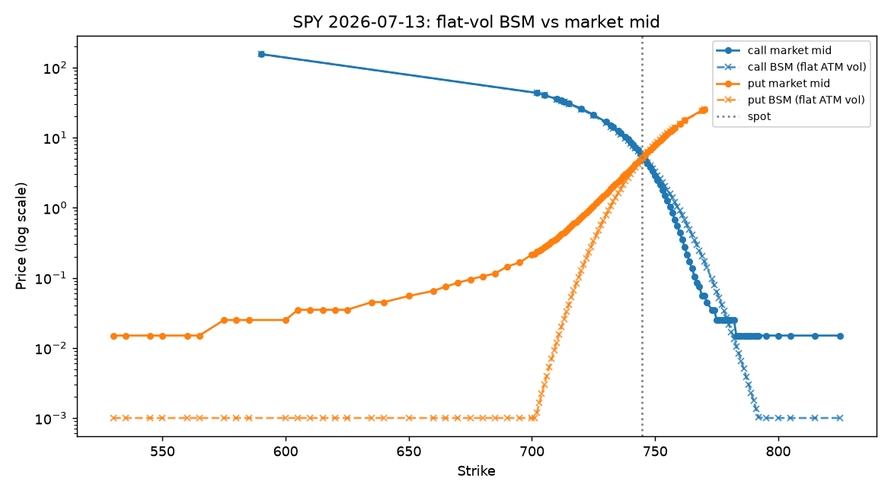
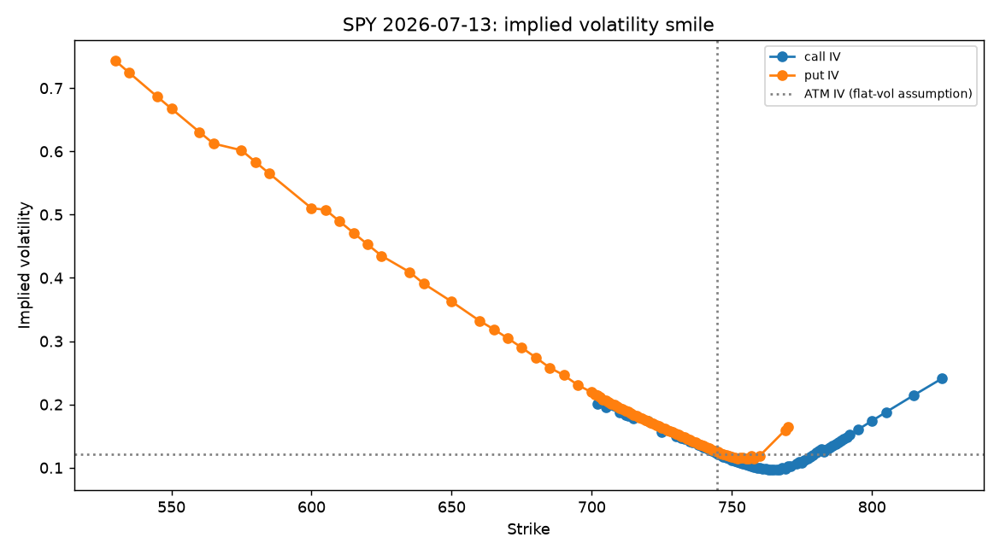

# Real-Time Options Pricing Engine

**Status: 4 pricing stages + FastAPI layer complete.** See build stages below.

## Live API

```bash
source venv/bin/activate
uvicorn backend.api.main:app --reload
# then open http://127.0.0.1:8000/docs for interactive Swagger UI
```

| Endpoint | What it does |
|---|---|
| `GET /price` | Price with `model=bsm\|binomial\|monte_carlo`; for Monte Carlo, `mc_variant=vanilla\|asian\|barrier`. Returns price, std error (MC only), and the live market quote for comparison (vanilla payoffs only — an Asian/barrier price has no listed quote to compare against, and the API says so rather than showing a misleading diff). |
| `GET /greeks` | `model=bsm\|binomial` (analytic vs. finite-difference). Monte Carlo Greeks are not implemented — not in scope for this build. |
| `GET /chain` | Live chain (both sides), annotated with liquidity/crossed-quote flags, solved IV per strike, and a put-call parity check. |
| `GET /iv-smile` | Strike → implied vol, for plotting. |
| `GET /expiries` | Listed expiries for a ticker (for populating a client dropdown). |

All parameters except `ticker` are optional — strike defaults to ATM, expiry defaults to the nearest listing at least 7 days out, volatility defaults to implied (falling back to realized, and saying so in `notes`).

## What this is

Prices options and computes Greeks from **live market data** — not
hardcoded or sample inputs. Spot price, dividend yield, and options
chains come from `yfinance`; the risk-free rate comes from FRED
(3-month T-bill, series `DGS3MO`). The engine re-prices whenever inputs
change; it does not cache stale theoretical values.

### On "real-time"

Options chain data via yfinance is typically ~15 minutes delayed on the
free tier; the underlying spot price is close to live. This project
does not claim streaming tick data. Prices and Greeks are computed
on-demand from the latest quote available from the data provider.

## Model vs. market (validation)

Generated by `validate_chain.py` against a live SPY chain. A flat
volatility assumption (Black-Scholes' core simplification) tracks the
market near the money but diverges sharply away from it — because the
market isn't pricing a flat vol, it's pricing the skew shown on the
right:




Regenerate against the current live chain:

```bash
source venv/bin/activate
python validate_chain.py SPY
```

## Stage 1: Black-Scholes-Merton

- `backend/models/black_scholes.py` — BSM price with continuous dividend
  yield (the Merton extension) and all five Greeks as closed-form
  analytic derivatives (not finite-difference).
- `backend/data/market_data.py` — live spot price, dividend yield,
  realized volatility, and options chain access via yfinance.
- `backend/data/risk_free_rate.py` — live 3-month T-bill rate from FRED.
- `backend/tests/test_black_scholes.py` — put-call parity check and a
  textbook reference value (Hull) as regression tests.
- `price_live_option.py` — end-to-end demo: prices a real, currently
  listed option using 100% live inputs and prints the model price next
  to the actual market quote for comparison.

Run the demo:

```bash
source venv/bin/activate
python price_live_option.py AAPL        # call
python price_live_option.py SPY --put   # put
```

Run tests:

```bash
source venv/bin/activate
python -m pytest backend/tests/ -v
```

## Stage 2: live chain, implied vol, data validators

- `backend/models/implied_vol.py` — Brent's method solver (bracketed,
  never diverges the way Newton-Raphson can on noisy real quotes).
  sigma constrained to `[0.001, 5.0]`, capped at 100 iterations, with a
  documented fallback message (not a NaN or exception) for near-expiry
  (`T < 1 trading day`), sub-intrinsic prices, and prices outside the
  reachable range.
- `backend/data/validators.py` — flags crossed/zero bid-ask, zero
  liquidity (no volume and no open interest), and put-call parity
  violations. Also stamps each row's days-since-last-trade as an
  informational field.
- `validate_chain.py` — pulls a live chain, runs the validators, solves
  IV at every tradeable strike, checks put-call parity, and produces
  the two plots above.

### A real bug this stage caught, and what it taught

My first cut of the staleness check flagged a quote as "stale" based on
`lastTradeDate` — how long ago that specific strike last actually
traded. On a live SPY chain this flagged **100% of rows**, because most
strikes in a chain go hours or days between trades even though their
bid/ask is continuously live from market makers. Time-since-last-trade
and quote-freshness are different things; conflating them would silently
kill the whole engine on any real chain. Fixed by moving staleness to
the *snapshot* level (how old is this whole chain pull?) and keeping
last-trade age as an informational field only, not a tradeability gate.

### Put-call parity: expect real violations, not just chain-edge noise

For SPY (American-style options), the classic European parity identity
`C - P = S·e^(-qT) - K·e^(-rT)` does **not** hold exactly — American
puts carry an early-exercise premium that pushes their price above the
European parity value, especially ITM. `validate_chain.py` surfaces this
explicitly rather than treating every violation as noise or a solver bug
(Stage 3's binomial tree is what actually prices that early-exercise
value).

## Stage 3: binomial tree, American exercise

- `backend/models/binomial_tree.py` — CRR recombining tree (numpy
  vectorized, default N=200-500 steps). `american=True` applies early
  exercise at every node (`price = max(exercise value, discounted
  continuation)`); `american=False` collapses to a European tree used
  purely as the convergence benchmark against BSM. Greeks are
  bump-and-reprice finite differences (no closed form exists for a tree
  price).
- `backend/tests/test_bsm_vs_binomial_convergence.py` — as N grows,
  binomial (European) converges to BSM (within $0.01 at N=1000); an
  American put is worth >= its European counterpart; an American call
  equals its European counterpart exactly when q=0 (never optimal to
  early-exercise a call with no dividend) and exceeds it when q>0.
- `price_american_option.py` — prices a real, currently listed ITM
  American option end-to-end: BSM European vs. binomial European
  (sanity check) vs. binomial American (shows the early-exercise
  premium), against the real market quote.

### Known limitation this stage surfaced (not fixed yet)

`price_american_option.py` solves implied vol by matching the
**European** BSM formula to a market price of an **American** option.
That market price already embeds early-exercise value, so the resulting
"implied vol" is biased downward to compensate for it — visible when the
script flags that the American-tree price ends up almost exactly the
early-exercise premium above the market mid. Feeding a European-implied
vol into the American tree double-counts exercise value. The correct
fix is to solve IV against the American tree directly (bisection on
`binomial_price`, not the BSM closed form) — intentionally deferred
rather than glossed over, since it's a materially different solve (no
closed-form vega to accelerate it, and the tree must be rebuilt at every
trial sigma).

### Theta from a tree is noisier than BSM's closed form, by construction

Bumping `T` for a finite-difference theta changes `dt = T/N` and
therefore the tree's entire node structure, not just its endpoint — a
well-known "ringing" effect in binomial-tree theta (see Hull). BSM's
closed-form theta doesn't have this problem since it's an exact
derivative, not a repriced perturbation. More steps reduce the noise but
never eliminate it; this is a structural property of finite-difference
theta on a tree, not a bug in this implementation.

## Stage 4: Monte Carlo, variance reduction

- `backend/models/monte_carlo.py` — GBM path simulation with antithetic
  variates (each `Z` paired with `-Z`). Every price comes back with a
  standard error, not just a point estimate. Prices vanilla (sanity
  check vs. BSM), arithmetic Asian (averaging payoff, no closed form
  exists), and barrier (up/down, in/out) options.
- `backend/tests/test_monte_carlo.py` — 6 tests: MC-vs-BSM convergence
  within the reported 3-sigma confidence interval; antithetic variance
  reduction; Asian call priced below vanilla (averaging suppresses
  effective volatility); and an exact in/out-parity identity
  (`up-and-out + up-and-in == vanilla`, verified on shared random paths
  to float precision, not just statistically).
- `price_exotic_option.py` — prices a real ATM call's Asian and
  barrier variants using live-derived inputs (spot, r, q, ATM implied
  vol), reports the antithetic variance reduction achieved, and
  documents discrete-monitoring bias on the barrier price.

### A real bug this stage caught: antithetic variates that didn't reduce variance

The first implementation generated `Z`/`-Z` path pairs correctly, but
computed the standard error as a naive `std(all payoffs) / sqrt(n)` —
which estimates the variance of an individual path's payoff, and is
blind to the negative correlation the pairing was supposed to exploit.
Across 10 test seeds it showed antithetic sampling with *worse* standard
error than naive sampling half the time — the reduction was real in the
simulated paths but invisible in the estimator. The fix: average each
`Z`/`-Z` pair *first*, then compute `std(pair_averages) / sqrt(n_pairs)`
on those pair-level averages. That is the estimator that actually
reflects the reduced variance; after the fix, antithetic sampling
reduced standard error by 20-45% across the demo and test cases.

## FastAPI layer

`backend/api/main.py` composes the four models above into `/price`,
`/greeks`, `/chain`, `/iv-smile`, and `/expiries` (see "Live API" at the
top). It's intentionally a thin wrapper — no pricing math lives here,
only live-input resolution (strike/expiry defaulting, vol-source
fallback) and response shaping. `backend/tests/test_api.py` covers it
with a monkeypatched market-data layer (no live network calls in CI);
the pricing math itself is already covered by the model-level tests.

Known API limitation: Monte Carlo Greeks aren't implemented (only BSM
and binomial), since `backend/models/monte_carlo.py` doesn't expose a
`greeks()` function — adding one wasn't needed for anything built so
far, and bump-and-reprice MC Greeks are expensive (each Greek needs 2+
full re-simulations) and noisy without careful common-random-numbers
handling, which is out of scope here rather than glossed over.

## Planned (stretch, not built)

- Heston / full stochastic-vol surface.
- Historical backtesting view (realized vol vs. what the market implied
  looking back N days).
- Frontend. The API above is what a frontend would call — it hasn't
  been built yet.

## Assumptions / limitations (will grow each stage)

- `price_live_option.py` (Stage 1 demo) still uses realized, not
  implied, volatility — `validate_chain.py` (Stage 2) is what backs out
  real implied vol per strike.
- BSM assumes European exercise; SPY/AAPL options are American. Stage 3
  adds the binomial tree that captures early-exercise value, but the IV
  fed into it is still solved against the European BSM formula (see
  Stage 3 limitation above) — an internally inconsistent pipeline that's
  documented rather than silently shipped as correct.
- Dividend yield is yfinance's trailing annual figure treated as a flat
  continuous yield; it is not a forward-looking dividend forecast.
- FRED's `DGS3MO` is a discount-basis annualized rate; it is used
  directly as `r` without converting between discount / bond-equivalent
  / continuously-compounded conventions. The difference is second-order
  for a 3-month rate but is a known simplification, not an oversight.
- The price-validation plot's percentage error is only reported for
  strikes with mid > $0.50 — near-zero far-OTM prices make percentage
  error blow up meaninglessly on a tiny denominator.
